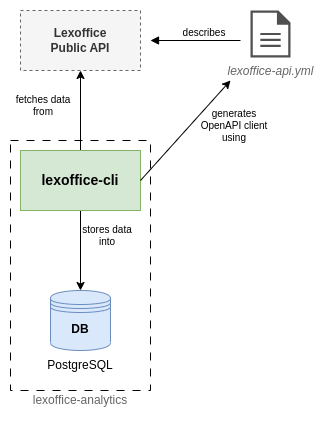

# LexOffice Analytics

This project is used to fetch data from a Lexoffice account using the [Lexoffice Public API](https://developers.lexoffice.io/docs/#lexoffice-api-documentation).\
The fetched data is stored inside a Postgres Database and can then be used to perform data analytics based on this data.

## System Architecture



**Components:**

- [lexoffice-cli](/lexoffice-sync/): A CLI application in Rust, which can be used to fetch the latest data from Lexoffice and save it to the database
- [DB](/db/): Data from Lexoffice is stored in a PostgreSQL database. At the moment:
  - Vouchers from `voucherlist` endpoint
  - Invoices from `invoices` endpoint

## lexoffice-cli

The `lexoffice-cli` can be run inside a Docker container. To run it, simply use the [Dockerfile](lexoffice-cli/Dockerfile) or run with `docker compose up`.

When running the application, the following environment variables are expected to be set:

- `DATABASE_URL`: PostgreSQL connection string (e. g. `postgres://[user]:[password]@[host]:[port]/[database]`)
- `LEXOFFICE_APIKEY`: API Key for Lexoffice account ([create a private API Key here](https://app.lexoffice.de/addons/public-api))
- `API_RATE_LIMIT` (optional, default 2): Limit of maximum requests per second (more info [here](https://developers.lexoffice.io/docs/#api-rate-limits))

**Usage:**

```shell
lexoffice-cli sync <VOUCHER_TYPE>
```

The parameter `VOUCHER_TYPE` is optional and can be one of the following:

- salesinvoice
- salescreditnote
- purchaseinvoice
- purchasecreditnote
- invoice
- downpaymentinvoice
- creditnote
- orderconfirmation
- quotation
- deliverynote

If `VOUCHER_TYPE` is not provided, all voucher types will be updated.
